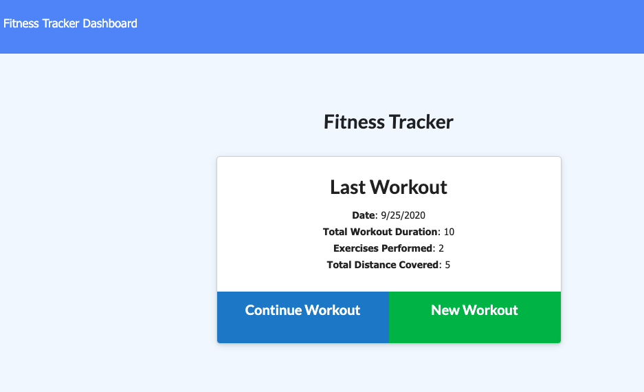
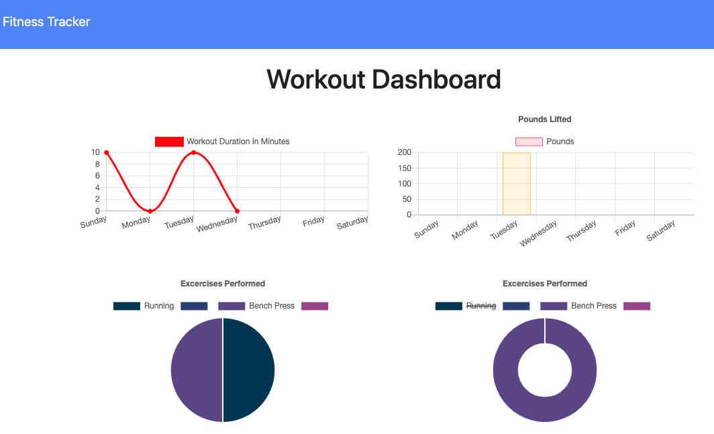

# Workout Tracker

## Description:
> This application allows the user to track their workout by name, type, weight, sets, reps, duration of exercise and distance of cardio. It also displays a work out dashboard with charts displaying the work out duration in minutes as well as pounds lifted for the week.

### [Deployed Link](https://kmarzi.github.io/fitness-tracker/.)
### [Heroku](https://safe-anchorage-97269.herokuapp.com/)